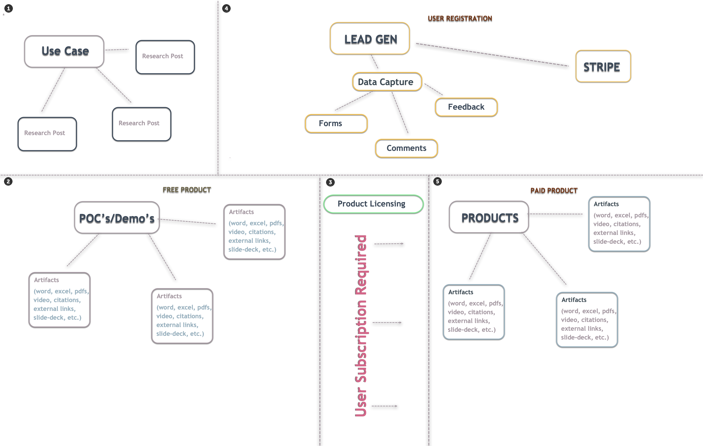

**Type:** Tekrogen Custom Ghost Pro Publishing System for Writers: Tekrogen Writing Design System
**Paired Feature:** (TBD)
**Status:** Proposed
**Date:** 2026-06-05
**Author:** @MJ163
**Inputs:**
- Tekrogen Design System Online: `https://claude.ai/design/p/833e0a82-84e5-46f8-b26f-a8a57f308a23`
- Working Directory: `/Users/martiniquehdolce/dev/tekrogen/Tekrogen-Ghost-theme-mockup`
- Tekrogen Projects Archive: `/Volumes/SERV01-DTMAC/2026/dev/tekrogen`
- GitHub: `https://github.com/tekrogen/Tekrogen-Ghost-Theme-Mockup`
---

## 1. Purpose

This planning directory defines **publishing scope + technical guardrails** for representing all four BNR pillars (org / studio / com / net) **inside a single custom Ghost Pro theme**.

> **The Tekrogen Publishing System Feature.** This document defines *what* the publishing system must achieve and defines *the process and rules it must follow* as the overall scope of the publishing system’s operational requirements, governance rules, and execution workflows. It establishes the complete process by which content, proof-of-concept artifacts, demos, and commercial products are created, related, versioned, distributed, and accessed across the Tekrogen ecosystem. The system defines the required publishing order, relationship mapping between content and products, membership and access controls for free and paid assets, licensing and delivery requirements, and the operational constraints that govern custom theme rendering, distribution pipelines, versioning, documentation, and product tracking lifecycle management.



---

## 1.1 Audience Model (BNR §2.4)

Tekrogen serves three audience segments, defined by relationship to the problem being solved:

| Segment                       | Description                                                                   | Entry Point                                                |
|-------------------------------|-------------------------------------------------------------------------------|------------------------------------------------------------|
| **Builders**                  | Developers and engineers who implement the solution directly                  | Technical detail in articles, code in demos                |
| **Technical Decision-Makers** | Founders, CTOs, and leads evaluating architecture and trade-offs              | Trade-off analysis in articles, architecture breakdowns    |
| **Operators & Buyers**        | Individuals or teams seeking a working solution without building from scratch | CTAs from articles to demos (.studio) and templates (.com) |

---

## 1.2 DDD Ubiquitous Language — Knowledge Bounded Context

These terms are used consistently across all sub-phases. NOTE: validate this with the UI-Kits, wireframes and stylesheets

| Term                     | Definition                                                                                  |
|--------------------------|---------------------------------------------------------------------------------------------|
| **Article**              | The aggregate root. A published piece of content on tekrogen.org.                           |
| **Study**                | Article subtype: a use-case study documenting a real build (BNR §5.2 structure).            |
| **Evaluation**           | Article subtype: a SaaS or tool evaluation with structured trade-off analysis.              |
| **Rating**               | Article subtype: a tech rating with scored criteria.                                        |
| **Slug**                 | URL-safe identifier for an article. Matches Ghost slug and Next.js dynamic route parameter. |
| **CanonicalUrl**         | The authoritative URL for an article: `https://tekrogen.org/articles/{slug}/`.              |
| **Tag**                  | A categorization label applied to an article.                                               |
| **Segment**              | Target audience segment: `builders`, `decision-makers`, or `operators` (from BNR §2.4).     |
| **DistributionChannel**  | An external platform where an article is cross-posted (TBD).                                |
| **PublishingRecord**     | Metadata tracking where an article has been distributed (channel, URL, date).               |
| **DocumentationChannel** | Instruction/Guides/Tutorials associated with Articles, Studies, POC/Demos, and Products     |
| **Versioning**           | Product release management                                                                  |
| **Repository**           | Product Library                                                                             |
| **TrackingRecord**       | Product + user data collection                                                              |


**Anti-corruption boundary:** The Knowledge context (.org) renders outbound URL strings to .studio demos and .com templates. It never imports code from sibling bounded contexts. Relationship to .studio and .com is Customer (downstream consumer of their URLs).

---


## 2. Workflow Publishing System Phase context

| Tag/Channel Hub                                              | Pillar/Domain   | Current State                                                                                    | Feature/Function                              |
|--------------------------------------------------------------|-----------------|--------------------------------------------------------------------------------------------------|-----------------------------------------------|
| 1. Reseach, Knowledge Hub, Use Case Study                    | tekrogen.org    | **Live on Ghost Pro.** Theme: `tekrogen-brand` v1.0.0-tekrogen.5 (TABA fork). FEAT-001 deployed. | Use Case Study Articles                       |
| 2. POC/Demonstration(s)                                      | tekrogen.studio | **Domain registered, no app yet.** Needs: Tag/Channel and relationship method/association        | Proof of concept for Use Case Study           |
| 3. Products                                                  | tekrogen.com    | **Domain registered, no app yet.** Needs: Tag/Channel and relationship method/association        | Extended, fully built POC                     |
| 4. Distribution/Repository/Versioning/Documentation/Tracking | tekrogen.net    | **Domain registered, no app yet.** Needs: Tag/Channel and relationship method/association        | Consider GitHub repo organization; no website |

**Implication.** The Ghost theme must visually carry all **four pillars** so writers and visitors understand the full Tekrogen system from one site. Currently, these are now BNR blockers (no actual checkout, no actual hosted demos, no actual distribution/repository/versioning/documentation/tracking endpoints).

---

## 3. Tekrogen BNR alignment to the Publishing Workflow

This workflow operationalizes specific [BNR sections](`/Users/martiniquehdolce/dev/tekrogen/Tekrogen-Brand-Design-System/admin/internal/business/01.Tekrogen_BNR_Roadmap_v1.md`). Every requirement traces back to one of these:

| Workflow System Stages                | Purpose                                                                                                                                                                                                                                                   | Function                                                                                                                                                                                                             |
|---------------------------------------|-----------------------------------------------------------------------------------------------------------------------------------------------------------------------------------------------------------------------------------------------------------|----------------------------------------------------------------------------------------------------------------------------------------------------------------------------------------------------------------------|
| Tekrogen Publishing Flywheel          | Use Case Study (.org) → Proof of Concept/Demo (.studio) → user registration/subscription → Product Sell (.com) → Product Repo/distribution (.net)                                                                                                         | Tags and Channels expose all four stages within `.org` until separate domains light up. They also should provide a relationship method to associate a Use Case Study to POC's and Products to Use Case Study and POC |
| 01. Use Case Study Article Structure  | 8-section format: Problem, Acceptance Criteria, Stack Decision, Trade-offs, Build, What We'd Do Differently, Outcome, CTA                                                                                                                                 | Content layer enforces this format via a custom Ghost Theme/page `custom-use-case-study.hbs`. Theme treats each use case study as an independent unit                                                                |
| 02. Proof of Concept/Demo  (POC)      | These are Research + Testing posts with artifacts associated with Use Case Study. One Use case may have many POC's and Products.                                                                                                                          | Content layer enforces this format via a `custom-proof-of-concept.hbs` and a relationship with a Use Case and other relevant POC's if applicable.                                                                    |
| 03. User Feedback/Comments (Lead Gen) | These determine if/when a POC becomes a Product and should be captured via POC comment section and inquiry form(s)                                                                                                                                        | Need to determine how this data will be captured, associated with use case and POC. Also must a relationship methodology and define rating system for POC to Product conversion                                      |
| 04. User Registration (Lead Gen)      | Users may view the POC's freely w/o registration online. Downloads require `Registration`.  A POC usage License is included in the download.                                                                                                              | License Tiers: Standard / Extended / Team commercial + MIT free                                                                                                                                                      |                                                                                                                                                   |
| 05. Product Strategy                  | These are market driven based on user feedback/comments/inquiries/ratings. Products are an extended, fully built POC                                                                                                                                      | Content layer enforces this format via a `custom-product.hbs` and a  relationship method with a use case and POC(s). Suggest a relationship strategy for other relevant Products, i.e., `You might like`...          |
| 06. User Subscription (Lead Gen)      | Product downloads require a `User Registration + Stripe subscription`.  A Product usage License is included in the download.                                                                                                                              | License Tiers: Standard / Extended / Team commercial + MIT free                                                                                                                                                      |
| 07. Existing Tekrogen Custom Theme    | An existing Tekrogn theme may be used which includes other functional components of custom pages, i.e, features, video and image integrations                                                                                                             | Theme may need to define a custom relationship strategy for Use Case Studies, POC's and Products                                                                                                                     |
| 08. Publishing System Roadmap         | Use Case Study → org credibility; POC → studio and Use Case Study demos; User data collection → (Forms, Feedback/Comments, Registration/Subscription); POC + Product Downloads → com commerce; TBD → POC + Product distribution/repository net versioning | The custom theme's job, as well as Tags and Channels are to *visually represent and asssociate relationships* between between all phases of the Publishing Flywheel                                                  |
| 09 Repository and Distribution (.net) | Critical to the success of managing POC's and Products distribution, tracking, and versioning.                                                                                                                                                            | Methodology is needed; Blocker                                                                                                                                                                                       |
---

### 4 Content type definitions

Each content type has a fixed shape, so editors know which pillar a given post belongs to:

| Content Type                                                   | Required signals                                                                                  | Optional signals                                            |
|----------------------------------------------------------------|---------------------------------------------------------------------------------------------------|-------------------------------------------------------------|
| **Use Case Study Article**                                     | Tagged `#feature-use-case-study` (or `#org`); follows BNR §5.2 7-section format                   | Paired POC's/Demos and Product via `#pair-{topic}`          |
| **Proof of Concept**                                           | Tagged `#feature-proof-of-concept` (or `#studio`); embeds Artifacts                               | Preview block; "try the Demo" external link                 |
| **Product**                                                    | Tagged `#feature-product` (or `#com`); renders product hero + license summary + access partial    | License tier badges; POC/Demo embed; download / inquiry CTA |
| **POC/Product Versioning/Distribution/Documentation/Tracking** | Tagged `#feature-product-details` (or `#net`); members-only visibility for downloadable artifacts | Versioning info; GitHub link; license link                  |

---

### 4.1 The four-pillar visual rule

**Every `Content Type` renders with one dominant pillar color** that signals what kind of content the visitor is on. Cross-pillar references (e.g., an article linking to a demo) carry the *destination's* color on the link/CTA, signaling forward motion through the flywheel.

This is the structural contribution of the theme: it makes the BNR Four Pillars **visible** to a visitor on a single Ghost site, without requiring them to navigate to separate domains.

---

## 5. Theme architecture mapping

### 5.1 Pillar → Ghost construct table

| Pillar / Tag / Channel                                     | Ghost template                | Channel route        | Listing page                    | Internal tag(s)             | Visibility default                             |
|------------------------------------------------------------|-------------------------------|----------------------|---------------------------------|-----------------------------|------------------------------------------------|
| org (Use Case Study Article)                               | `custom-use-case-study.hbs`   | `/use-case-studies/` | `channel-use-case-studies.hbs`  | `#feature-use-case-study`   | public                                         |
| studio (POC Demo)                                          | `custom-proof-of-concept.hbs` | `/poc/`              | `channel-proof-of-concepts.hbs` | `#feature-proof-of-concept` | public (gated registration download per-post)  |
| com (Product)                                              | `custom-product.hbs`          | `/products/`         | `channel-products.hbs` (        | `#feature-product`          | members (gated subscription download per-post) |
| net (Distribution/Repos/Versioning/Tracking/Documentation) | `TBD`                         | `/TBD/`              | `TBD`                           | `#feature-product-detail`   | members                                        |

### 5.2 Cross-pillar partials

Reusable partials that render on multiple content types:

| Partial                                            | Used on                       | Purpose                                                                                                                       |
|----------------------------------------------------|-------------------------------|-------------------------------------------------------------------------------------------------------------------------------|
| `partials/components/license-summary.hbs`          | Product                       | Renders the three license tiers + free tier (Standard / Extended / Team + Free MIT)                                           |
| `partials/components/product-access.hbs`           | Product, Product Detail       | Member/paid gating for downloads (Ghost-native `{{#if @member}}` / `{{#if @member.paid}}`)                                    |
| `partials/components/product-proof-of-concept.hbs` | Product POC/Demo              | Demo block — Demo embedded artifacts + gated download if applicable                                                           |
| `partials/components/inquiry-form.hbs`             | Product, POC/Demo (edge case) | Consider Formspree / Tally fallback for "need customization / Standard / Extended license"                                    |
| `partials/components/paired-content-cta.hbs`       | Article, POC/Demo, Product    | Cross-pillar "next step" CTA — Article → Demo, Demo → Product, Product → Distribution/Repos/Versioning/Tracking/Documentation |
| `partials/components/pillar-badge.hbs`             | All                           | Renders pillar identity + color on cards and headers                                                                          |

**NOTE: This is just an incompleted list. Consider other partials for tracking and relationship methods.**

---

### 5.3 The five functional layers (orthogonal to pillars)

Pillars are *content classification*. Layers are *system functions* that cut across pillars. There are exactly five:

| Layer                                      | Concern                                                        | Implemented via                                                                                                                                         |
|--------------------------------------------|----------------------------------------------------------------|---------------------------------------------------------------------------------------------------------------------------------------------------------|
| **L1 — Content**                           | Editorial substance, BNR §5.2 article format                   | `custom-use-case-study.hbs`, Ghost posts, custom-use-case-study.hbs, Koenig editor                                                                      |
| **L2 — POC/Demonstration + License **      | Showing how the use case works. May include artifacts          | `custom-proof-of-concept.hbs`, artifacts, product-proof-of-concept partial, license-summary partial, EULA link                                          |
| **L3 — Product + License**                 | Productizing the POC/Demo artifact, surfacing license tiers    | `custom-product.hbs`, license-summary partial, product-access partial, EULA link                                                                        |
| **L4 — Membership + Subscription Payment** | Access control via Ghost members + Stripe subscription Connect | Ghost Portal, paid tier (Stripe Connect), `{{#if @member}}` / `{{#if @member.paid}}`)                                                                   |
| **L5 — Form (edge case)**                  | Lead intake for non-default license requests                   | Consider Formspree / Tally; rendered only on Product templates as a "need something else?" fallback                                                     |
| **L6 — Distribution/Documentation**        | Product Documentation +  Distribution                          | `#feature-product-detail`, Consider Formspree / Tally; rendered only on Product templates as a "need something else?" Tracking data collection fallback |
| **L7 — Tracking/Repos/Versioning/**        | Data collection: User feedback/comments/inquiries/purchases    | TBD                                                                                                                                                     |

## 5.4 Layer Hierarchy

```
[ Membership (L4) ] → [ Product Access (L3) ]  → [ Tracking + Data Collection (L7)] → [ License Defines Usage (L3) ] → [ Edge Cases (L5 — Form) ] → [Distribution + Documentation (L6) ] → [Tracking + Versioning + Repo (L7) ]
                              ↑
                      ( Demo (L2) — proof )
                              ↑
                      ( Content (L1) — credibility )
```

Forms (L5) are **fallback infrastructure**, not the conversion mechanism. The conversion mechanism is **member sign-up + paid-tier upgrade** (L4).

---

## 5.5 Article Structure Format (BNR §5.2)

Every use-case study follows this structure:

1. **The Problem** — what specific pain point motivated the build, stated honestly.
2. **Acceptance Criteria** — a clear list of what the work must do to count as finished. Every item is a yes or a no, not a judgment call.
3. **The Stack Decision** — what was chosen to solve it — tools, methods, or both — and what was evaluated and rejected, and why
4. **Key Trade-offs** — every important choice came with a cost. Name what you gained and what you gave up. Tell the truth about both.
5. **The Build** — architecture decisions, package structure, key engineering choices. The work itself: the decisions and choices that shaped the result, technical or otherwise.
6. **What We'd Do Differently** — honest retrospective. This section builds trust.
7. **The Outcome** — what was built/produced, what it does, what it does not do
8. **CTA** — where this leads next. For technical studies: the free demo on .studio and the paid template on .com. For exploratory studies: the deliverable artifacts themselves (flowchart, sample report, downloadable workflow) or the next study in the series. Includes links to the free demo/paid product.

This structure applies in all sub-phases regardless of publishing platform (Ghost or MDX).

---

## 6. What's IN scope for Phase A (and WF-001)

This is the workflow's scope envelope.

| In scope                                                    | Pillar / Layer      | Notes                                                                                                                              |
|-------------------------------------------------------------|---------------------|------------------------------------------------------------------------------------------------------------------------------------|
| Article surface (existing)                                  | org / L1            |                                                                                                                                    |
| POC/Demo surface (templates + listing + tag)                | studio / L2         | Embedded artifacts                                                                                                                 |
| Product surface (templates + listing + tag)                 | com / L3            | Product hero + license summary + access partial + edge-case form                                                                   |
| Distribution/Versioning/Tracking/Repo/Documentation surface | net / L6,L7         | Members-only posts, distribution, versioning, documentation, and tracking                                                          |
| License-summary partial                                     | com / L2-L4         | Renders Standard / Extended / Team / Free tiers per BNR §7.1                                                                       |
| Product-access partial                                      | com / L2-L7         | Ghost-native `{{#if @member}}` / `{{#if @member.paid}}` gating; download links                                                     |
| Pillar-badge partial                                        | all / cross-cutting | Visual pillar identity on cards and post headers. Pillar cross association/references/relationships chaining                       |
| Cross-pillar paired CTA                                     | all / L1-L7         | Article → POC/Demo → Product → Distribution → Documentation → Versioning → Repo "next step" link chain (uses `#pair-{topic}`       |
| Edge-case inquiry form, feedback, comments                  | com / L5-L7         | Consider: Formspree (or similar). How does Ghost manage this?                                                                      |
| Ghost-native paid tier (Stripe Connect)                     | L2-L7               | "Free" + "Membership" tiers, configured in Ghost admin; theme renders gated content per `{{#if @member}}` / `{{#if @member.paid}}` |
| Article-authoring guide instructions/templates/updates      | L6-L7               | Pillar tagging conventions, pairing tag, license-tier policy, member visibility rules                                              |
| Routes + tag taxonomy                                       | infrastructure      | New `/poc/`, `/products/` routes; new tag entries in `tags.json` , `routes.yaml` and `redirects.yaml` if applicable                |
| Theme color CSS variables (per pillar)                      | System brand        | Four pillar tokens exposed as CSS custom properties in `default.hbs` `:root` block (See UI Kits, Stylesheets, Assets)              |

---

## 7. Knowledge & Process Gap Detection

**Missing or undefined SOPs.**

- Editorial intake, **review gates**, voice/format QA for BNR §5.2 sections.
- **Tagging playbook** (internal vs. public tags, pair-tag conventions, migrations).
- **When** to create POC vs. Product posts vs. net-only detail posts.

**Artifact versioning.** No **semantic versioning policy**, changelog obligation, or **rollback** story.

**Update workflows.** Content refresh vs. **product patch** vs. **breaking license change** — unowned.

**Licensing enforcement.** Display vs. **enforceable** terms; **MIT vs. commercial** coexistence on same site.

**Customer support ownership.** Who answers license questions, broken downloads, refunds?

**Content / product retirement.** Unpublish vs. **redirect** vs. **legacy notice** — absent.

**Analytics ownership.** Events for flywheel funnel — absent.

**Refund / chargeback / access revocation.** Not addressed — **critical** once Stripe billing is live.

**Release management.** Theme releases vs. content releases vs. artifact releases — **undifferentiated**.

**Security / compliance.** PII in forms, retention, cookie/consent — **not in README scope** but required operationally.

---

## 8. Changelog

| Date       | Change                                                                                                                                                       | Author   |
|------------|--------------------------------------------------------------------------------------------------------------------------------------------------------------|----------|
| 2026-05-16 | Initial draft. Synthesizes BNR Roadmap v1, Tekrogen Forms Research (MJ163), Tekrogen Theme Architecture (MJ163), and  four-pillar workflow publishing scope. | MJ163    |
| 2026-06-05 | Building the Publishing Workflow boundaries to assist with page topics and layouts for the Tekrogen Ghost Theme Mockup                                       | tekrogen |

---

**End of index.md.**