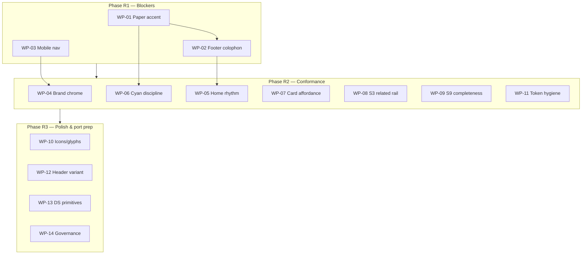

# Tekrogen Flywheel Mockup — Comprehensive Remediation Plan

**Date:** 2026-06-17  
**Surface:** `mockups/Tekrogen-Flywheel/index.html` (`Flywheel · v1.0.0`)  
**Supersedes:** `admin/features/proposed/tekrogen-mockup-revamp/remediation-plan/REMEDIATION-PLAN.md` (gap register only — this document adds VD-AC mapping, screen-by-screen closure, work packages, validation protocol, and Ghost-port checklist)  
**Authoritative for:** what must be fixed before the mockup is declared **Ghost-theme-ready**

---

## 1. Purpose and scope

This plan closes the gap between **what the project claims** (Phase E / `v0.15.0` lock, status docs, issue completion %) and **what renders** when `mockups/Tekrogen-Flywheel/index.html` is served and compared against:

| Reference | Role |
|-----------|------|
| **Tekrogen Brand Design System** (vendored `components/`, `colors_and_type.css`, ADRs) | Token, component, and AA authority |
| **VD specs** (`admin/features/proposed/tekrogen-mockup-revamp/visual-domains/FEAT-VD-00…09`) | Per-screen acceptance criteria |
| **Root `index.html`** | Locked publication mockup — layout composition, tagline, footer colophon |
| **`mockups/Claude-DT/index.html`** | Structural reference the VD specs were derived from |
| **User annotated screenshots** (`admin/issues/tekrogen-ghost-theme-mockup*.png`) | Human-reported defects |
| **Prior conformance review** (issues **#34–#42**) | Already-filed DS gaps |

**In scope:** visual, UX, accessibility, organism conformance, and VD-AC closure on all nine screens.  
**Out of scope:** real Ghost/Stripe/Portal wiring, building the production `.hbs` theme, upstream DS work except where explicitly required (mobile nav primitive, card hover upstream).

**North star:** the mockup must be a credible foundation for a production-quality custom Ghost Pro theme — not a documentation exercise.

---

## 2. Methodology

### 2.1 Review lenses (3-expert panel)

Per `/Volumes/SERV01-DTMAC/_Code_Library/AI prompts/Design-System-UIUX-Review-Prompt.md`:

1. **Senior Product Designer** — hierarchy, rhythm, affordance, cognitive load  
2. **Design Systems Architect** — tokens, one-cyan rule, component contract, governance  
3. **Front-End Engineering Lead** — rem/AA/focus, responsive behaviour, maintainability  

Ghost architecture lens per `GHOST-CRM-AND-THEME-EXPERT.md`: native routing, semantic landmarks, RSS/colophon, mobile nav, minimal JS.

### 2.2 Validation protocol (mandatory after every PR)

Phase E skipped this. **No item closes without it.**

1. **Serve** the repo: `python3 -m http.server` from repo root — never `file://`.  
2. Open `http://localhost:8000/mockups/Tekrogen-Flywheel/index.html`.  
3. For the affected screen(s), toggle **Ink and Paper** on the harness surface toggle.  
4. Render at **1440px** and **390px** (DevTools device mode or headless Chrome).  
5. **Static token audit** on changed CSS:
   - Every `font-size` is a `--tk-fs-*` token (no ad-hoc px on text).  
   - Nothing below the **12px legibility floor** (`--tk-fs-eyebrow` / `--tk-fs-meta`).  
   - Body/secondary text ≥ `--tk-fg-3`; never `--tk-fg-4/5` for load-bearing text.  
6. **Overflow check** at 390px: `document.documentElement.scrollWidth === document.documentElement.clientWidth`.  
7. **Paper AA spot-check**: no raw `#1fd5da` cyan as text on white/light surfaces.  
8. **Keyboard pass** on changed interactive elements: Tab order, `:focus-visible` ring, Escape to close overlays.  
9. Record result in `admin/review/VALIDATION.md` (screenshot paths + pass/fail per AC).  
10. **User sign-off** on rendered screenshots — not on documentation.

---

## 3. Honest status correction

| Claim | Reality |
|-------|---------|
| Phase E lock / `v0.15.0` = layout ready | **Premature.** Validated overflow + token floor in Ink only; Paper untested; 9 open conformance issues ignored. |
| `mockups/CLAUDE.md`: "VD-00 + VD-01 built; s2–s9 stubs" | **Stale.** s2–s9 are populated (~1,040 lines). Structural build is largely complete; **conformance is not**. |
| Flywheel `v1.0.0` badge | **Overstated** while R1 blockers remain open. |
| "33/34 components consumed" | **True** — but organism-level conformance (footer, nav, accent, affordance) lags component count. |

**Verdict:** The surface is a **credible structural rehearsal** of all nine VD domains with improvements over Claude-DT (12px type floor, s3 heading order, s2 rel pips). It is **not Ghost-theme-ready**.

Treat `v0.15.0` / Flywheel `v1.0.0` as **checkpoint tags**, not locks.

---

## 4. What already works (do not regress)

- Loads `colors_and_type.css` + vendored `components/tk-components.css`; uses **33/34** `tk-*` components with correct `data-tk-slot` contract.  
- Flat, hairline, Ink-primary aesthetic; pillar colours as accents, never page backgrounds.  
- Cross-pillar `rel` rows use **pip + word** (WCAG 1.4.1) — s2 listing cards.  
- Recon model respected: no numeric ratings/scores on any screen.  
- Zero horizontal overflow at 390px on all nine screens (verified in static audit).  
- s3 improves Claude-DT: real `<h2>` section heads, `aria-current` on TOC.  
- s4 decision callout uses theme-aware `--tk-accent` (Paper-safe pattern to extend).

The problem is **organism conformance, visual rhythm, interaction affordance, and Paper accessibility** — the layer that makes it production-credible.

---

## 5. Cross-cutting findings

Severity: **Critical** = ship blocker · **High** = R1 · **Medium** = R2 · **Low** = R3 · **Gov** = governance

| ID | Finding | Sev | VD AC | Issue | Primary files |
|----|---------|-----|-------|-------|---------------|
| **CC-01** | **Paper-mode AA failure.** `:root{--wing-accent:var(--tk-cyan)}` never flips under stage `data-tk-theme="paper"`. Eyebrows, `.principle .pn`, active TOC use raw cyan on white → fails WCAG 1.4.3. | Critical | AC-VD00-08, AC-VD00-10 | #36 | `index.html` L37, L45, L119, L133 |
| **CC-02** | **No footer colophon.** All nine footers use `data-style="nav"` without `data-tk-slot="colophon"` (©, Colophon, RSS, Contact). Cramped column rhythm. RSS required for Ghost. | Critical | AC-VD00-03 | #35 | All footers; DS `footer.html` L16–19 |
| **CC-03** | **No mobile navigation.** `@media(max-width:768px)` hides nav with `display:none`; no hamburger/menu toggle. All primary destinations unreachable on phone. | Critical | AC-VD00-01 | #34 | `index.html` L235; DS new `navigation` component |
| **CC-04** | **Brand not a home link.** `<div data-tk-slot="brand">` ×9; DS specimen is `<a href="/">`. | Medium | — | #37 | Mastheads L302, L380, … |
| **CC-05** | **Cards read as static.** `tk-content-card` / `tk-listing-card` not link-wrapped; hover is border-tint only; no pointer cursor or focus ring. | Medium | AC-VD06-05 | #38-adj | s1, s2, s6; `content-card.css` L21 |
| **CC-06** | **Cyan inflation.** Multiple cyan surfaces per screen (eyebrows + CTA + stats) violates one-cyan rule. | Medium | AC-VD01-02 | #38 | `.eyebrow` L45; s1 L321, L357 |
| **CC-07** | **Hardcoded `.lead` size.** `font-size:18px` bypasses `--tk-fs-*` scale. | Medium | AC-VD00-09 | new | L47 |
| **CC-08** | **No `<main>` landmark.** Theme markup lacks semantic main wrapper. | Medium | AC-VD00-10 | new | All screens |
| **CC-09** | **Framed header only.** `data-style="framed"` everywhere; production sticky+blur variant never demonstrated. | Medium | — | #57/B2 | All mastheads |
| **CC-10** | **Off-table glyphs + double rotation.** `.stamp{rotate(-3deg)}`; `⊘ ⌕ ●` outside approved table. | Low | ADR-0005 | watch | L147, L611, L794, L914–918 |
| **CC-11** | **Version/governance skew.** Release stamped while defects open; doc drift (`CLAUDE.md`, L371 "placeholders" comment). | Gov | — | #41 | Version markers; `mockups/CLAUDE.md` |

---

## 6. Screen-by-screen gap analysis

### 6.1 S1 — Home (`FEAT-VD-01`)

**Lines:** L294–369 · **Ghost:** `home.hbs`

| AC | Status | Gap / action |
|----|--------|--------------|
| AC-VD01-01 | ✓ | Pillar buttons + hero flywheel above fold |
| AC-VD01-02 | ✗ | Multiple cyan surfaces — **CC-06** |
| AC-VD01-03 | ✓ | Featured cards show rel chips |
| AC-VD01-04 | ✓ | Count 24 matches s2 classbar |
| AC-VD01-05 | ✓ | No scores |
| AC-VD01-06 | ✗ | Paper AA — **CC-01** |
| VD-00 inherited | ✗ | Footer colophon **CC-02**; mobile nav **CC-03** |

**Additional gaps:**

| ID | Issue | Fix |
|----|-------|-----|
| S1-01 | H1 paraphrases locked tagline. Current: "We build real solutions to real problems." Locked: **"Real solutions. Built, proven, ready to use."** Also in `og:title` / `twitter:title` L23–29. | Replace H1 verbatim; demote current line to `.lead` dek if desired |
| S1-02 | Cramped hero→featured rhythm. `.wrap` featured section `padding-top:0` L356; stats butt against section-head. | Add `--tk-space-16/20` between stats block and featured section-head |
| S1-03 | Hero grid imbalance — flywheel floats in void on right. | Rework `.hero` grid proportions; scale `tk-flywheel` to fill column |
| S1-04 | vs root `index.html`: footer uses pillar **cards** with left accent + colophon row — Flywheel footer reads incomplete | Address via **CC-02** + spacing |

**vs root `index.html`:** Root H1 L1822 uses locked tagline; `.type-card:hover` L573 shows stronger affordance than Flywheel cards.

---

### 6.2 S2 — Case Study Channel (`FEAT-VD-02`)

**Lines:** L372–446 · **Ghost:** `channel-use-case-studies.hbs`

| AC | Status | Gap / action |
|----|--------|--------------|
| AC-VD02-01 | N/A | Mockup cannot prove `routes.yaml` — document mapping only |
| AC-VD02-02 | ✓ | Rel rows with destination pips L399–431 |
| AC-VD02-03 | ✓ | Count 24 consistent |
| AC-VD02-04 | ✓ | Pattern reusable (only .org rendered) |
| AC-VD02-05 | ✗ | Paper AA; listing cards not interactive — **CC-01**, **CC-05** |

**Additional gaps:**

| ID | Issue | Fix |
|----|-------|-----|
| S2-01 | Pagination is static `.pager` L436–439, not DS Pagination primitive | WP-13 (port queue) or minimal accessible `<nav aria-label="Pagination">` |
| S2-02 | Listing card headlines not wrapped in `<a>` | Link-wrap entire card or headline |

---

### 6.3 S3 — Use Case Study Reader (`FEAT-VD-03`)

**Lines:** L447–527 · **Ghost:** `custom-use-case-study.hbs`

| AC | Status | Gap / action |
|----|--------|--------------|
| AC-VD03-01 | ✓ | 8 BNR sections L488–515 |
| AC-VD03-02 | ✓ | TOC sticky; collapses `@media 1080px` L212–213 |
| AC-VD03-03 | ✓ | Trade-offs `tk-table` L498–502 |
| AC-VD03-04 | ✓ | `tk-cta-block[data-pillar="com"]` L514–515 |
| AC-VD03-05 | ✗ | **No related-content rail** — prose references sidebar links L495 but TOC rail only has TOC + reading time L468–479 |
| AC-VD03-06 | ✗ | Paper AA on eyebrow/active TOC — **CC-01** |

**Additional gaps:**

| ID | Issue | Fix |
|----|-------|-----|
| S3-01 | Add related rail block in TOC column: paired Recon, Demo, Product links with destination pillar colour | New markup in `.toc-rail` after `.rt-card` |
| S3-02 | `.stamp` rotate — **CC-10** | Remove `transform:rotate(-3deg)` from `.stamp` L147 |

---

### 6.4 S4 — Recon Reader (`FEAT-VD-04`)

**Lines:** L528–589 · **Ghost:** `custom-recon.hbs`

| AC | Status | Gap / action |
|----|--------|--------------|
| AC-VD04-01 | ✓ | Qualitative table, no score column |
| AC-VD04-02 | ✓ | No-scores guardrail callout |
| AC-VD04-03 | ✓ | Decision callout + `.feeds` |
| AC-VD04-04 | ✓ | Upstream/downstream links |
| AC-VD04-05 | ✓ | Topic labels |
| AC-VD04-06 | ✗ | Paper AA if accent paths use `--wing-accent` — **CC-01** |

**Additional gaps:** Inline `style` on Sources h2 L571 — replace with token utility class.

---

### 6.5 S5 — Demo / POC (`FEAT-VD-05`)

**Lines:** L590–652 · **Ghost:** `custom-proof-of-concept.hbs`

| AC | Status | Gap / action |
|----|--------|--------------|
| AC-VD05-01 | ✓ | Full read + gated downloads L630–641 |
| AC-VD05-02 | ✓ (mock) | Gate annotated — acceptable for mockup |
| AC-VD05-03 | ✓ | MIT in `tk-demo-meta` |
| AC-VD05-04 | ✓ | Paired CTA L644–646 |
| AC-VD05-05 | ✗ | Paper AA; live `●` glyph L611 — **CC-01**, **CC-10** |

**Port-time note:** `tk-demo-preview` iframe needs `title` attribute at Ghost build.

---

### 6.6 S6 — Product & Licensing (`FEAT-VD-06`)

**Lines:** L653–759 · **Ghost:** `custom-product.hbs`

| AC | Status | Gap / action |
|----|--------|--------------|
| AC-VD06-01 | ✓ | 4 tiers, Standard featured |
| AC-VD06-02 | ✓ | Excluded states on tier lists |
| AC-VD06-03 | ✓ | Stepper 05–06 `here` L675–676 |
| AC-VD06-04 | ✓ | LemonSqueezy seam L736–740 |
| AC-VD06-05 | ✗ | Provenance cards L749–751 have no links — **CC-05** |
| AC-VD06-06 | ✗ | Paper AA on section eyebrows — **CC-01** |

---

### 6.7 S7 — Documentation (`FEAT-VD-07`)

**Lines:** L760–838 · **Ghost:** `channel-documentation.hbs`

| AC | Status | Gap / action |
|----|--------|--------------|
| AC-VD07-01 | ✓ | Stepper 07–08 here |
| AC-VD07-02 | ✓ | `tk-pipeline` |
| AC-VD07-03 | Partial | Six categories present; icons are 2-letter monograms IN/AP/TU/RN/VS/CP — not Lucide per ADR-0005 |
| AC-VD07-04 | ✓ | Version timeline + breaking flag |
| AC-VD07-05 | Partial | Portal gating in copy only; links not visually gated |
| AC-VD07-06 | ✗ | Paper AA — **CC-01** |

**Additional gaps:** Search uses `⌕` L794; only s7 footer includes **Releases** in `.net` column L836 — add to all footers for consistency.

---

### 6.8 S8 — About (`FEAT-VD-08`)

**Lines:** L839–891 · **Ghost:** `page.hbs`

| AC | Status | Gap / action |
|----|--------|--------------|
| AC-VD08-01 – 04 | ✓ | Hero, manifesto, no-scores principle, team + placeholder |
| AC-VD08-05 | ✗ | `.principle .pn` uses `--wing-accent` — **CC-01** |

**Additional gaps:** Inline avatar `font-size:13px` L882–883 — use `--tk-fs-body-sm` or meta token.

---

### 6.9 S9 — Membership & Account (`FEAT-VD-09`)

**Lines:** L892–1009 · **Ghost:** members + `account.hbs`

| AC | Status | Gap / action |
|----|--------|--------------|
| AC-VD09-01 | ✓ | Access ladder with ✓/✕ |
| AC-VD09-02 | ✓ | Auth cards + ghost-notes |
| AC-VD09-03 | ✗ | **No rendered free-member slim dashboard** — only paid view L954–977 + ghost-note L978 |
| AC-VD09-04 | ✓ | Purchase confirmation + keyline |
| AC-VD09-05 | ✗ | Request form L997–999 omits VD fields (Problem, Industry, Priority, Budget, Contact) |
| AC-VD09-06 | Partial | Vendored `member-ladder` excluded text uses `--tk-fg-5` — fix upstream |

**Additional gaps:** Copy button L986 lacks toast/feedback primitive (WP-13 port queue).

---

## 7. VD acceptance scorecard

| Screen | Met | Partial | Unmet / N/A | Blockers |
|--------|-----|---------|-------------|----------|
| **s1** | 4 | 0 | 2 + VD-00 | CC-01, CC-02, CC-03, CC-06, S1-01 |
| **s2** | 3 | 0 | 2 (1 N/A) | CC-01, CC-05 |
| **s3** | 4 | 0 | 2 | CC-01, S3-01 |
| **s4** | 5 | 0 | 1 | CC-01 |
| **s5** | 4 | 0 | 1 | CC-01, CC-10 |
| **s6** | 4 | 1 | 1 | CC-01, CC-05 |
| **s7** | 4 | 2 | 1 | CC-01, Lucide icons |
| **s8** | 5 | 0 | 1 | CC-01 |
| **s9** | 3 | 1 | 2 | S9 free dashboard, form fields |

**~75% structural AC met.** Remaining failures cluster on three cross-cutting defects (Paper accent, footer, mobile nav) plus screen-specific completeness (s3 rail, s9 dashboard).

---

## 8. Work packages

Each WP: **open issue → branch `<type>/<issue#>-<slug>` → PR (`Closes #N`) → validation protocol §2.2 → merge.**

Effort: **S** ≤ half day · **M** 1–2 days · **L** 3+ days (may span DS repo)

---

### WP-01 — Paper accent fix (CC-01 / #36) · **S · R1 · DO FIRST**

**Problem:** `--wing-accent` is set on `:root` with raw `--tk-cyan` and wing swatches override on `documentElement`. Paper theme on `#stage` flips `--tk-accent` but not `--wing-accent`.

**Recommended fix (preferred):** Route accent-bearing selectors through `--tk-accent` (already Paper-aware inside `[data-tk-theme="paper"]`):

```css
/* Replace --wing-accent with --tk-accent on TEXT accents only */
.eyebrow { color: var(--tk-accent); }
.principle .pn { color: var(--tk-accent); }
.toc a[aria-current="true"] { color: var(--tk-accent); }
```

Keep `--wing-accent` for **filled** CTA buttons and harness wing swatches (fills, not text).

**Alternative:** Define stage-scoped override:

```css
.stage[data-tk-theme="paper"] {
  --wing-accent: #086a6f; /* paper-AA teal — matches --tk-accent */
}
```

**Files:** `mockups/Tekrogen-Flywheel/index.html` L37, L45, L119, L133  
**Validates:** AC-VD00-08, AC-VD00-10; unblocks honest Paper testing for all screens  
**Do not close until:** Paper render shows no cyan text failing AA on eyebrows, `.pn`, active TOC across s1, s3, s8.

---

### WP-02 — Footer colophon + rhythm (CC-02 / #35) · **M · R1**

**Problem:** Nav-variant footer omits colophon; columns cramped against brand block.

**Fix:** After each footer's `</div></div>` (pillars close), add colophon slot per DS specimen:

```html
<div data-tk-slot="colophon">
  <span>© 2026 Tekrogen · Martinique Dolce</span>
  <nav><a href="#">Colophon</a><a href="#">RSS</a><a href="#">Contact</a></nav>
</div>
```

**Also:**
- Add **Releases** link to `.net` column on all nine footers (currently s7 only).  
- Verify mobile brand span rule L249–250 holds with colophon present.  
- If nav variant cannot carry colophon upstream, switch to default `tk-footer` (pillar cards) per DS `footer.html` L1–20 — discuss with DS before editing vendored `components/`.

**Files:** All footers L366–367, 443–444, … 1006–1007; optionally DS `footer.css` upstream  
**Validates:** AC-VD00-03; Ghost RSS requirement

---

### WP-03 — Mobile navigation (CC-03 / #34) · **L · R1**

**Problem:** Nav hidden at ≤768px with no fallback. `tk-site-header` has no responsive primitive (documented in `mockups/CLAUDE.md`).

**Fix (two-repo):**

1. **DS upstream:** Build `tk-navigation` / mobile menu primitive — hamburger toggle, full nav drawer, Search, keyboard trap + Escape, `aria-expanded`, focus return.  
2. **Consumer:** Replace blind `display:none` L235 with component wiring in all nine mastheads.  
3. **Harness:** Ensure `.shell-bar` does not cause false overflow at 390px (see `mockups/CLAUDE.md` mobile gotcha).

**Files:** DS `components/navigation/` (new); `mockups/Tekrogen-Flywheel/index.html` mastheads + `@media` L223–235  
**Validates:** AC-VD00-01; every nav destination reachable at 390px via real control

---

### WP-04 — Brand chrome quick fixes · **S · R2**

| Task | Change | Lines |
|------|--------|-------|
| Logo → home link | `<div data-tk-slot="brand">` → `<a data-tk-slot="brand" href="#/">` ×9 | Mastheads |
| Locked tagline (S1-01) | H1 → "Real solutions. Built, proven, ready to use."; update og/twitter meta L23–29 | s1 hero L322 |
| `<main>` landmark | Wrap each screen's theme content (after masthead, before footer) in `<main>` | All screens |

**Validates:** #37, #39, AC-VD00-10

---

### WP-05 — Home rhythm & hero balance (S1-02, S1-03) · **M · R2**

**Changes:**
- Remove `style="padding-top:0"` from featured `.wrap` L356; use `padding-top: var(--tk-space-16)` or `--tk-space-20`.  
- Add margin-bottom on `.tk-stats` block after hero stats L328–333.  
- Rework `.hero` grid L107: increase flywheel max-width / align vertically; reduce dead space in right column.  
- Audit inter-section gaps on s2–s9 `.wrap` blocks for consistent `--tk-space-16` cadence.

**Validates:** Visual parity with root `index.html` spacing rhythm

---

### WP-06 — Cyan discipline (CC-06 / #38) · **S · R2 · do with WP-01**

**Rule:** One cyan **filled** action per screen (primary CTA). Eyebrows use muted mono (`--tk-fg-3` or `--tk-accent` at AA, not decorative cyan).

**s1 specifically:**
- Hero eyebrow L321 → `--tk-fg-3` or mono uppercase without cyan  
- Section-head eyebrow L357 → same  
- Keep cyan on primary "Explore Case Studies" CTA only

**Validates:** AC-VD01-02, brand one-cyan rule

---

### WP-07 — Card interaction affordance (CC-05) · **M · R2**

**Consumer:**
- Wrap `tk-content-card` / `tk-listing-card` in `<a class="card-link">` or make headline an `<a>`.  
- Add `:focus-visible` outline using `--tk-focus`.

**Upstream (DS):** Strengthen `content-card.css` hover — add `cursor:pointer`, optional `--tk-shadow-sm` lift:

```css
.tk-content-card:hover {
  border-color: color-mix(in srgb, var(--pillar, var(--tk-cyan)) 55%, var(--tk-border));
  box-shadow: var(--tk-shadow-sm);
  cursor: pointer;
}
```

**Files:** s1 featured cards, s2 listing cards L395–432, s6 provenance L749–751; `components/content-card/content-card.css`  
**Validates:** AC-VD06-05; root `.type-card:hover` parity

---

### WP-08 — S3 related rail (S3-01 / AC-VD03-05) · **S · R2**

Add block in `.toc-rail` after reading-time card:

```html
<div class="rt-card">
  <p class="meta">Related</p>
  <nav aria-label="Related flywheel content">
    <a href="#" data-pillar="org">Recon · Framework shortlist</a>
    <a href="#" data-pillar="studio">Demo · OAuth exchange</a>
    <a href="#" data-pillar="com">Product · Spine template</a>
  </nav>
</div>
```

Style links with destination pillar colour (pip + word pattern).

---

### WP-09 — S9 completeness (AC-VD09-03, AC-VD09-05) · **M · R2**

1. **Free-member dashboard variant:** Add second sub-screen block showing slim view (favorites + submitted requests only) with `state-pill` "free member".  
2. **Request form expansion:** Add fields per VD-09 — Problem description, Industry, Priority, Budget, Contact information L997–999.

---

### WP-10 — Icons & glyph cleanup (CC-10 / #40) · **S · R3**

- Replace s7 category monograms with Lucide SVGs (stroke 1.5, `currentColor`).  
- Remove `.stamp { transform: rotate(-3deg) }` L147.  
- Replace `⊘` L634, `⌕` L794, `●` L611 with Lucide or approved mono glyphs.

---

### WP-11 — Token hygiene · **S · R2**

| Item | Fix |
|------|-----|
| `.lead` L47 | `font-size: var(--tk-fs-lead)` or nearest scale token |
| Inline `style=` attributes | Replace with utility classes (s5, s6, s7, s9) |
| Avatar text L882–883 | `--tk-fs-body-sm` |

**Validates:** AC-VD00-09

---

### WP-12 — Production header variant (#57 / B2) · **M · R3**

Document and demonstrate `tk-site-header` **default** (sticky + blur) on at least one screen (e.g. s3 reader). Keep `framed` on home/channel previews where device frame is intentional.

Add mapping table to `mockups/CLAUDE.md`:

| Template | Header variant |
|----------|----------------|
| `home.hbs`, channel templates | `framed` (in-frame preview) |
| Readers, product, docs, account | default sticky |

---

### WP-13 — DS interactive primitives port queue (#42) · **L · R3**

Build upstream before Ghost port — not blocking layout lock:

| Primitive | Used on |
|-----------|---------|
| Pagination | s2 `.pager` |
| Checkbox / Select | s9 forms |
| Tabs / Accordion | s7 docs TOC |
| Tooltip / Toast | s9 copy button |
| Alert | formalize `.tk-callout` usage |

---

### WP-14 — Governance & doc sync (CC-11 / #41) · **S · ongoing**

- Do **not** bump Flywheel version until R1 + R2 pass validation gate §9.  
- When bumping: align `<meta name="version">`, `.ver` badge, `CHANGELOG.md` per repo ritual.  
- Update `mockups/CLAUDE.md`: s2–s9 are built, not stubs.  
- Remove stale comment L371 "S2–S9 — placeholders".  
- Retire or annotate `admin/status/phase-e-lock-release-v0.15.0-status-2026-06-17.md` as superseded.

---

## 9. Execution phases



### Phase R1 — Ship blockers (do not start Ghost theme)

| Order | WP | Est. | Unblocks |
|-------|-----|------|----------|
| 1 | WP-01 Paper accent | S | Honest Paper validation on all screens |
| 2 | WP-02 Footer colophon | M | VD-00 footer AC; Ghost RSS |
| 3 | WP-03 Mobile nav | L | Functional mobile UX |

### Phase R2 — Brand + UX conformance

| Order | WP | Est. | Notes |
|-------|-----|------|-------|
| 4 | WP-04 Brand chrome | S | Quick wins |
| 5 | WP-06 Cyan discipline | S | Pair with WP-01 |
| 6 | WP-05 Home rhythm | M | s1 first, then audit s2–s9 |
| 7 | WP-07 Card affordance | M | May need DS re-vendor |
| 8 | WP-08 S3 related rail | S | AC-VD03-05 |
| 9 | WP-09 S9 completeness | M | AC-VD09-03/05 |
| 10 | WP-11 Token hygiene | S | AC-VD00-09 |

### Phase R3 — Polish & port preparation

| Order | WP | Est. |
|-------|-----|------|
| 11 | WP-10 Icons/glyphs | S |
| 12 | WP-12 Production header | M |
| 13 | WP-13 DS primitives | L |
| 14 | WP-14 Governance | S (continuous) |

---

## 10. Comparison reference — three surfaces

| Pattern | Root `index.html` | Claude-DT | Tekrogen-Flywheel | Remediation target |
|---------|-------------------|-----------|-------------------|-------------------|
| Hero tagline | Locked verbatim | Paraphrased | Paraphrased | **Root / DS** |
| Footer colophon | `.site-foot .bot` row | Missing | Missing | **Root / DS specimen** |
| Footer pillars | Accent cards | Nav columns | Nav columns | Nav + colophon |
| Card hover | Border tint + affordance | Weak border only | Weak border only | **Root-level affordance** |
| Paper AA | Stage-scoped toggle | Same wing-accent bug | Same bug | **DS `--tk-accent` pattern** |
| Mobile nav | Collapsed (legacy) | Hidden, no menu | Hidden, no menu | **New DS primitive** |
| Type floor | Mixed legacy px | Some 10px leftovers | 12px floor | **Keep Flywheel improvement** |
| s3 TOC | N/A | `<p>` eyebrows | `<h2>`, `aria-current` | **Keep Flywheel improvement** |

---

## 11. Ghost port readiness checklist

Before transcribing mockup → `.hbs` theme:

- [ ] All R1 + R2 work packages merged  
- [ ] Validation protocol §2.2 passed for all nine screens  
- [ ] Paper: zero accent text AA failures  
- [ ] Mobile: all nav destinations reachable  
- [ ] Footer: colophon on every template  
- [ ] Cards: link + hover + focus on all listing/featured cards  
- [ ] s3: related rail present  
- [ ] s9: free + paid dashboard variants; complete request form  
- [ ] Harness code clearly bounded (`<!-- APP CHROME -->` / `<!-- GHOST THEME -->`)  
- [ ] Component gaps fixed upstream and re-vendored (not patched in mockup repo)  
- [ ] User sign-off on rendered screenshots at 1440 + 390, Ink + Paper  

**Ghost mapping reminder (from VD README):**

| Screen | Template |
|--------|----------|
| s1 | `home.hbs` |
| s2 | `channel-use-case-studies.hbs` |
| s3 | `custom-use-case-study.hbs` |
| s4 | `custom-recon.hbs` |
| s5 | `custom-proof-of-concept.hbs` |
| s6 | `custom-product.hbs` |
| s7 | `channel-documentation.hbs` |
| s8 | `page.hbs` |
| s9 | members + `account.hbs` |

---

## 12. Issue cross-reference

| GitHub issue | Work package | Finding ID |
|--------------|--------------|------------|
| #34 Mobile nav | WP-03 | CC-03 |
| #35 Footer colophon | WP-02 | CC-02 |
| #36 Paper AA accent | WP-01 | CC-01 |
| #37 Logo home link | WP-04 | CC-04 |
| #38 One cyan per surface | WP-06 | CC-06 |
| #39 Locked tagline | WP-04 | S1-01 |
| #40 Lucide icons | WP-10 | s7 |
| #41 Version/governance | WP-14 | CC-11 |
| #42 DS primitives | WP-13 | — |
| #57 (BDS) Production header | WP-12 | CC-09 |

---

## 13. Final verdict

| Criterion | Grade | Notes |
|-----------|-------|-------|
| Structural VD coverage | **B+** | All nine screens built; anatomy matches specs |
| DS component consumption | **A-** | 33/34 registry; slot contract correct |
| Organism conformance | **D+** | Footer, nav, accent, affordance fail |
| Accessibility (Paper) | **F** | Raw cyan text on white — confirmed |
| Responsiveness | **D** | No overflow, but no mobile nav |
| Ghost-theme-ready | **Not ready** | R1 blockers + R2 conformance required |

**Overall: Production-ready with significant improvements required.**

Minimum credible next sprint: **WP-01 → WP-02 → WP-03**, then R2 batch, then user sign-off on renders — not on documentation.

---

*Prepared from live files on disk. Every conclusion is reproducible by serving the repo and rendering `mockups/Tekrogen-Flywheel/index.html` in Ink and Paper at 1440px and 390px.*
